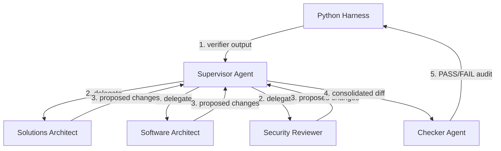

# Agentic Documentation Loop

## Document Status
Approved

## Purpose
Overview of the agentic documentation loop, current Claude skills operating model, and reference prompt-agent architecture.

## Owner
Architecture Team

## Last Updated
2026-07-02

---

See the [Agent Tooling Glossary](./glossary.md) for agent-system terms and the [Project Glossary](../glossary.md) for target-system vocabulary.

---

## 1. What is the Agentic Loop?

The agentic documentation loop is a controlled documentation maintenance system. It combines deterministic Python validation, explicit repository policy, Claude skills, and human source-fact ownership to keep architecture documentation structurally healthy without allowing AI to invent missing facts.

The loop advances the repository from a simple validated template (Level 3 Harness) to an active documentation partner (Level 4 Loop Engineering). Higher maturity levels, such as semantic drift detection and scheduled maintenance, are described in [strategy.md](../strategy.md).

---

## 2. Current Execution Model

The current reliable execution model is:

```text
human request
  ↓
Claude Code skill selection
  ↓
repository policy and validation state review
  ↓
bounded repair, scaffold, or escalation
  ↓
python3 run_validation.py
```

Primary current components:

| Component | Status | Purpose |
|---|---|---|
| `.claude/skills/` | Current | Claude Code skill instructions and triggers. |
| `.claude/skills/tests/` | Current | Skill trigger, repair-plan, source-fact, retirement, and executable behavior fixtures. |
| `.validation-config.json` | Current | Shared validation gate configuration. |
| `run_validation.py` | Current | Local validation runner. Intended CI target. |
| `verify_*.py` | Current | Deterministic validation gates. |
| `agent/SKILL.md` | Current | Policy authority for write boundaries and documentation rules. |

The current operating rule is:

```text
observe → plan → ask/escalate → repair → verify
```

---

## 3. Reference / Future Prompt-Agent Model

The `agent/prompts/` directory describes a Supervisor plus specialist-agent topology. Treat these prompts as a reference or future harness design unless a runtime explicitly wires them into execution.

They are retained because they document the intended multi-agent decomposition:

- Supervisor / Director
- Solutions Architect
- Software Architect
- Security Reviewer
- Checker

The currently dependable execution path remains the Claude skills and verifier model described above.

---

## 4. Directory Structure

Agent-system files live in both `.claude/` and `agent/`:

```text
.claude/skills/                 Current Claude Code skill operating layer
.claude/skills/tests/           Skill fixtures and executable behavior tests
agent/SKILL.md                  Governing policy
agent/GOAL.md                   Success criteria definition
agent/STATE.md                  Ephemeral run state (gitignored)
agent/decisions/                ADRs for the agentic loop design
agent/docs/                     Reference documentation for skills and agent frameworks
agent/prompts/                  Reference / future prompt-agent design
agent/logs/                     Escalation logs written on loop failure
```

Key files:

* **[Agent Tooling Glossary](./glossary.md):** Controlled vocabulary for the AI documentation operating system.
* **[SKILL.md](./SKILL.md):** Governing policy: allowlists, blocklists, and documentation rules.
* **[GOAL.md](./GOAL.md):** Success criteria definition.
* **[ADR-0002](./decisions/0002-agentic-loop-architecture.md):** Agentic loop architecture decision.
* **[ADR-0003](./decisions/0003-agentic-team-collaboration.md):** Multi-agent team collaboration decision.
* **[supervisor_prompt.md](./prompts/supervisor_prompt.md):** Reference Supervisor prompt.
* **[solutions_architect_prompt.md](./prompts/solutions_architect_prompt.md):** Reference Solutions Architect prompt.
* **[software_architect_prompt.md](./prompts/software_architect_prompt.md):** Reference Software Architect prompt.
* **[security_reviewer_prompt.md](./prompts/security_reviewer_prompt.md):** Reference Security Reviewer prompt.
* **[checker_system_prompt.md](./prompts/checker_system_prompt.md):** Reference Checker prompt.
* **[maker_system_prompt.md](./prompts/maker_system_prompt.md):** Legacy generic Maker prompt retained for reference.
* **[docs/](./docs/claude-skills-specification.md):** Agent framework documentation.

---

## 5. Operational Commands

Run these commands from the repository root.

### Preferred validation command

```bash
python3 run_validation.py
```

This command loads `.validation-config.json` and runs the configured validation gates in order.

### Harness commands

The Python harness remains available for loop-state preparation:

```bash
# Check loop status
python3 agent_harness.py --status

# Run verifiers, update STATE.md, and print the Supervisor brief
python3 agent_harness.py --prepare

# Reset loop state for a fresh execution
python3 agent_harness.py --reset
```

Harness exit codes for `--prepare`:

| Code | Meaning |
|---:|---|
| 2 | Success: verifier scripts exited `0`; loop terminates. |
| 1 | Escalated: loop stopped due to max iterations, lack of progress, or blocklist violation. |
| 0 | Continue: failures remain; `agent/STATE.md` contains the next brief. |

---

## 6. Reference Multi-Agent Topology

The reference prompt-agent topology is:



This topology is a design reference. It is not the same thing as the current Claude Code skills execution path unless explicitly wired by a runtime.

---

## 7. Stop Authority Rule

The agent is never allowed to declare success based on its own opinion. Success is defined by deterministic verification gates exiting successfully.

Current preferred command:

```bash
python3 run_validation.py
```

Until CI is simplified, GitHub Actions may still list individual verifier commands. The strategic target is for local validation and CI validation to use the same runner.
