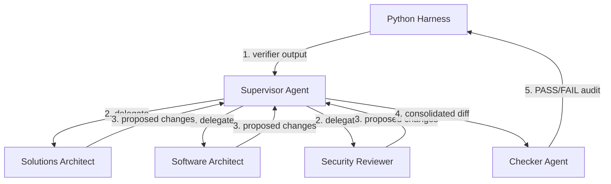

# Agentic Documentation Loop

## Document Status
Approved

## Purpose
Overview of the agentic documentation loop and multi-agent architecture team.

## Owner
Architecture Team

## Last Updated
2026-07-02

---

See [Glossary](../glossary.md) for definitions of key terms.

---

## 1. What is the Agentic Loop?

The agentic documentation loop is an autonomous system that governs and maintains the architecture-as-code repository. It uses a combination of a deterministic Python validation harness and a multi-agent team of specialized architects to automatically identify structural errors, fill in missing metadata, check for compliance, and resolve linter/E2E failures.

It advances the repository from a simple validated template (Level 3 Harness) to an active, autonomous documentation partner (Level 4 Loop Engineering).

---

## 2. Directory Structure

All files related to the agentic system live inside the `agent/` folder:

*   **[SKILL.md](./SKILL.md):** Governing policy (allowlists, stop rules).
*   **[GOAL.md](./GOAL.md):** Success criteria definition.
*   **STATE.md:** Ephemeral run state (gitignored).
*   **[decisions/](./decisions/0002-agentic-loop-architecture.md):** System architecture decisions.
    *   [ADR-0002](./decisions/0002-agentic-loop-architecture.md): Agentic loop architecture.
    *   [ADR-0003](./decisions/0003-agentic-team-collaboration.md): Multi-agent team collaboration design.
*   **[prompts/](./prompts/supervisor_prompt.md):** System prompts for all agents.
    *   [supervisor_prompt.md](./prompts/supervisor_prompt.md): Coordinates specialists.
    *   [solutions_architect_prompt.md](./prompts/solutions_architect_prompt.md): Solutions Architect prompt.
    *   [software_architect_prompt.md](./prompts/software_architect_prompt.md): Software Architect prompt.
    *   [security_reviewer_prompt.md](./prompts/security_reviewer_prompt.md): Security Reviewer prompt.
    *   [maker_system_prompt.md](./prompts/maker_system_prompt.md): Generic Maker (legacy) prompt.
    *   [checker_system_prompt.md](./prompts/checker_system_prompt.md): Checker prompt.
*   **logs/:** Escalation logs (written on loop failure).

---

## 3. Operational Harness & Commands

The orchestrator loop is driven by the pure Python script `agent_harness.py` at the repository root. Run these commands from the root:

```bash
# 1. Start or check the loop status
python3 agent_harness.py --status

# 2. Run verifiers, update STATE.md, and print the Supervisor brief
python3 agent_harness.py --prepare

# 3. Reset the loop state for a fresh execution
python3 agent_harness.py --reset
```

### Harness Exit Codes (`--prepare`):
*   `2` — **SUCCESS:** Both verifier scripts (`verify_docs.py` and `verify_e2e.py`) exited `0`. Loop terminates.
*   `1` — **ESCALATED:** Loop stopped due to max iterations, lack of progress, or blocklist violation. Details written to `agent/logs/ESCALATION.md`.
*   `0` — **CONTINUE:** Failures remain. The brief has been written to `agent/STATE.md`. Claude Code should act as the **Supervisor** to fix them.

---

## 4. Multi-Agent Team Architecture

The loop follows an **Incident Response topology (Supervisor + Specialists)**:



### Role Summary:
1.  **Supervisor:** Analyzes failure summaries, delegates to specialists, and merges their outputs.
2.  **Solutions Architect:** Updates business, system, and external context files, and ADRs.
3.  **Software Architect:** Updates system views, quality attributes, and technical standards.
4.  **Security Reviewer:** Updates risks and assumptions logs.
5.  **Checker:** Audits final proposed changes against SKILL.md rules before writing to disk.

---

## 5. Stop Authority Rule

The agent is never allowed to declare success based on its own opinion. Success is defined exclusively by the Python verification scripts (`verify_docs.py` and `verify_e2e.py`) exiting with code 0.
