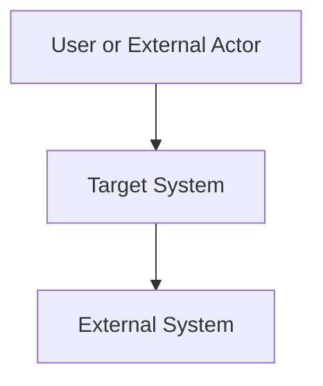

# System Context

## Document Status
Draft

## Purpose
Define the target system boundary, purpose, responsibilities, scope, non-responsibilities, external dependencies, and high-level context.

## Owner
<!-- AI_HINT: PENDING_DISCOVERY - DO NOT AUTOFILL -->
TBD

## Last Updated
2026-07-02

---

## System Purpose
<!-- AI_HINT: PENDING_DISCOVERY - DO NOT AUTOFILL -->
Document what the system is for and the problem it solves.

## System Responsibilities
<!-- AI_HINT: PENDING_DISCOVERY - DO NOT AUTOFILL -->
Document the primary responsibilities the system owns.

## In Scope
<!-- AI_HINT: PENDING_DISCOVERY - DO NOT AUTOFILL -->
Document capabilities, behaviors, data, integrations, and operational responsibilities that are explicitly in scope.

## Explicit Non-Responsibilities
<!-- AI_HINT: PENDING_DISCOVERY - DO NOT AUTOFILL -->
Document what the system must not own. This section is required to prevent boundary drift.

## External Dependencies
<!-- AI_HINT: PENDING_DISCOVERY - DO NOT AUTOFILL -->
Document external systems, platforms, APIs, services, data sources, and users that interact with the system. Keep detailed integration ownership in [External Systems](./external-systems.md).

## High-Level Context Diagram
<!-- AI_HINT: PENDING_DISCOVERY - DO NOT AUTOFILL -->
Add a C4 System Context diagram or equivalent high-level diagram here.

## Architecture Clarity Notes
<!-- AI_HINT: PENDING_DISCOVERY - DO NOT AUTOFILL -->
Document any context needed for developers or reviewers to understand what should and should not be built.

---

See [Glossary](../../glossary.md) for definitions of key terms used in this document.
