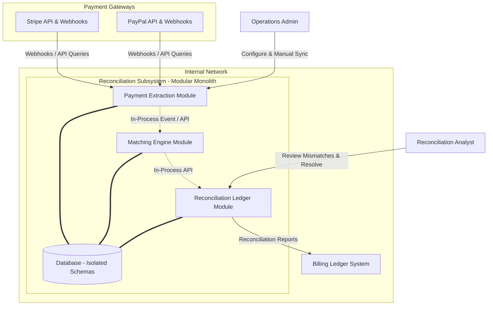

# System Context

## Document Status
Approved

## Purpose
This document establishes the system boundary, scope, high-level responsibilities, and external dependencies of the Distributed Payment Reconciliation Subsystem.

## Owner
Architecture Team

## Last Updated
2026-06-11

## System Purpose
The Distributed Payment Reconciliation Subsystem acts as an automated audit layer. It continuously fetches transaction logs from external payment providers (Stripe, PayPal) and compares them against internal Billing Ledger logs to ensure financial consistency, catch double-billing, detect missing cash deposits, and log exceptions.

## System Responsibilities
- **Transaction Ingestion:** Fetching historical payment logs and accepting real-time webhook payloads from Stripe and PayPal.
- **Rule-Based Matching:** Aligning gateway charges and disputes with internal invoice ledger entries based on ID, amount, timestamp, and gateway reference.
- **Exception Logging:** Flagging discrepancies (e.g., amount mismatches, missing ledger records, duplicate charges) and logging them as exceptions.
- **Reporting & Syncing:** Pushing resolved match batches and daily reconciliation metrics down to the central Billing Ledger system.

## In Scope
- Webhook endpoints for receiving near real-time payment notifications.
- Daily scheduled batch retrieval of transaction and payout reports via external APIs.
- Automated multi-pass matching engine executing on a configurable cron schedule.
- DB persistence of raw ingested transactions, match outcomes, and manually resolved exceptions.

## Explicit Non-Responsibilities
- Initiating, capturing, or canceling charges or refunds on Stripe/PayPal.
- Generating new customer invoices or modifying ledger transactions directly without authorization.
- Identity management for analysts (handled by external Enterprise Identity Providers).

## External Dependencies
- **Stripe API:** Gateway service used to retrieve transaction logs and capture webhook alerts.
- **PayPal API:** Gateway service used to query transaction logs and capture webhook alerts.
- **Billing Ledger API:** Downstream destination for daily reconciliation results and exceptions.

## High-Level Context Diagram

---

See [Glossary](../../glossary.md) for definitions of key terms used in this document.
