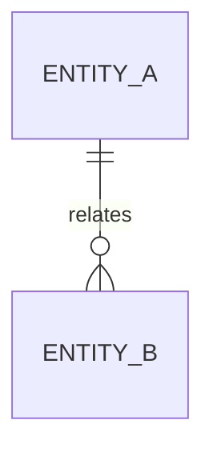

# Data View

## Document Status
Draft

## Purpose
Define the target system's data architecture, including core entities, ownership, lifecycle, classification, retention, and data-boundary rules.

## Owner
<!-- AI_HINT: PENDING_DISCOVERY - DO NOT AUTOFILL -->
TBD

## Last Updated
2026-07-02

---

> Not all architecture views require equal depth.
> Populate this view when data ownership, lifecycle, classification, reporting, compliance, or integration concerns affect architecture or implementation decisions.

## Core Entities
<!-- AI_HINT: PENDING_DISCOVERY - DO NOT AUTOFILL -->
Document the main business and system entities that must be understood before implementation.

| Entity | Description | Owner | Notes |
|---|---|---|---|
| <!-- AI_HINT: PENDING_DISCOVERY - DO NOT AUTOFILL --> TBD | TBD | TBD | TBD |

## Data Ownership
<!-- AI_HINT: PENDING_DISCOVERY - DO NOT AUTOFILL -->
Document which module, bounded context, service, or system owns each data set.

| Data Set | Owner | Read Access | Write Access | Notes |
|---|---|---|---|---|
| <!-- AI_HINT: PENDING_DISCOVERY - DO NOT AUTOFILL --> TBD | TBD | TBD | TBD | TBD |

## Data Lifecycle
<!-- AI_HINT: PENDING_DISCOVERY - DO NOT AUTOFILL -->
Document how important data is created, updated, read, archived, deleted, or synchronized.

| Data Set | Created By | Updated By | Consumed By | Lifecycle Notes |
|---|---|---|---|---|
| <!-- AI_HINT: PENDING_DISCOVERY - DO NOT AUTOFILL --> TBD | TBD | TBD | TBD | TBD |

## Data Classification
<!-- AI_HINT: PENDING_DISCOVERY - DO NOT AUTOFILL -->
Document classification levels, sensitivity, privacy concerns, or regulatory considerations.

| Data Set | Classification | Handling Requirements | Notes |
|---|---|---|---|
| <!-- AI_HINT: PENDING_DISCOVERY - DO NOT AUTOFILL --> TBD | TBD | TBD | TBD |

## Retention
<!-- AI_HINT: PENDING_DISCOVERY - DO NOT AUTOFILL -->
Document retention requirements, deletion rules, archival expectations, and audit needs.

| Data Set | Retention Period | Deletion or Archive Rule | Source |
|---|---|---|---|
| <!-- AI_HINT: PENDING_DISCOVERY - DO NOT AUTOFILL --> TBD | TBD | TBD | TBD |

## Data Model Diagram
<!-- AI_HINT: PENDING_DISCOVERY - DO NOT AUTOFILL -->
Replace this placeholder with a high-level entity or data ownership diagram when useful.

## Architecture Clarity Notes
<!-- AI_HINT: PENDING_DISCOVERY - DO NOT AUTOFILL -->
Document data rules that developers must preserve during implementation.

---

See [Glossary](../../glossary.md) for definitions of key terms used in this document.
