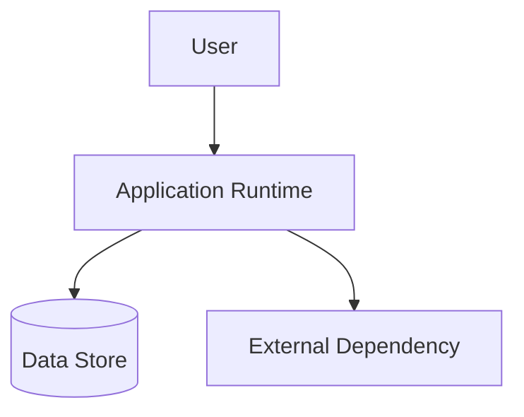

# Deployment View

## Document Status
Draft

## Purpose
Define where the target system runs, how its runtime parts are arranged, and what environment assumptions matter for implementation.

## Owner
<!-- AI_HINT: PENDING_DISCOVERY - DO NOT AUTOFILL -->
TBD

## Last Updated
2026-07-02

---

## Environments
<!-- AI_HINT: PENDING_DISCOVERY - DO NOT AUTOFILL -->
Document the environments used for the system.

| Environment | Purpose | Notes |
|---|---|---|
| <!-- AI_HINT: PENDING_DISCOVERY - DO NOT AUTOFILL --> TBD | TBD | TBD |

## Infrastructure Elements
<!-- AI_HINT: PENDING_DISCOVERY - DO NOT AUTOFILL -->
Document the main infrastructure elements that support the system.

| Element | Purpose | Notes |
|---|---|---|
| <!-- AI_HINT: PENDING_DISCOVERY - DO NOT AUTOFILL --> TBD | TBD | TBD |

## Runtime Components
<!-- AI_HINT: PENDING_DISCOVERY - DO NOT AUTOFILL -->
Document the runtime components and where they execute.

| Runtime Component | Location | Responsibility |
|---|---|---|
| <!-- AI_HINT: PENDING_DISCOVERY - DO NOT AUTOFILL --> TBD | TBD | TBD |

## Environment Boundaries
<!-- AI_HINT: PENDING_DISCOVERY - DO NOT AUTOFILL -->
Document important boundaries between users, applications, data stores, and external dependencies.

| Boundary | Description | Notes |
|---|---|---|
| <!-- AI_HINT: PENDING_DISCOVERY - DO NOT AUTOFILL --> TBD | TBD | TBD |

## Scaling Considerations
<!-- AI_HINT: PENDING_DISCOVERY - DO NOT AUTOFILL -->
Document expected scaling model, capacity assumptions, and known constraints.

## Deployment Diagram
<!-- AI_HINT: PENDING_DISCOVERY - DO NOT AUTOFILL -->
Replace this placeholder with a deployment diagram showing runtime components and environment boundaries.

## Architecture Clarity Notes
<!-- AI_HINT: PENDING_DISCOVERY - DO NOT AUTOFILL -->
Document deployment assumptions that affect development decisions.

---

See [Glossary](../../glossary.md) for definitions of key terms used in this document.
