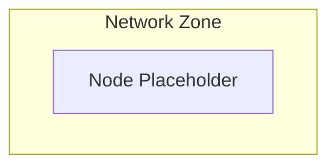

# Deployment View

## Document Status
Draft

## Purpose
<!-- AI_HINT: PENDING_DISCOVERY - DO NOT AUTOFILL -->
TBD

## Owner
<!-- AI_HINT: PENDING_DISCOVERY - DO NOT AUTOFILL -->
TBD

## Last Updated
2026-06-11

> Not all architecture views require equal depth.
> Populate only when justified by architectural concerns.

## Environments
<!-- AI_HINT: PENDING_DISCOVERY - DO NOT AUTOFILL -->
TBD

## Infrastructure
<!-- AI_HINT: PENDING_DISCOVERY - DO NOT AUTOFILL -->
TBD

## Network Zones
<!-- AI_HINT: PENDING_DISCOVERY - DO NOT AUTOFILL -->
TBD

## Runtime Components
<!-- AI_HINT: PENDING_DISCOVERY - DO NOT AUTOFILL -->
TBD

## Scaling Considerations
<!-- AI_HINT: PENDING_DISCOVERY - DO NOT AUTOFILL -->
TBD

