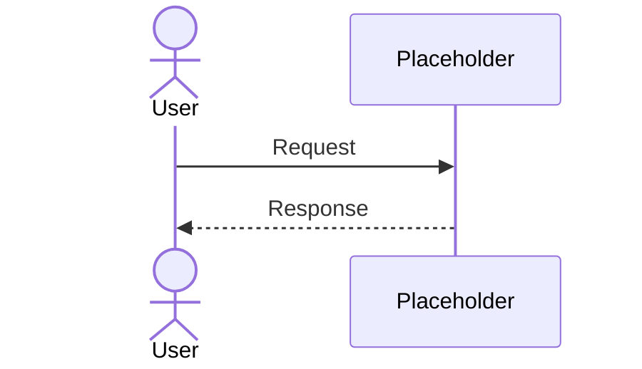

# Integration View

## Document Status
Draft

## Purpose
<!-- AI_HINT: PENDING_DISCOVERY - DO NOT AUTOFILL -->
TBD

## Owner
<!-- AI_HINT: PENDING_DISCOVERY - DO NOT AUTOFILL -->
TBD

## Last Updated
2026-06-11

> Not all architecture views require equal depth.
> Populate only when justified by architectural concerns.

## APIs
<!-- AI_HINT: PENDING_DISCOVERY - DO NOT AUTOFILL -->
TBD

## Events
<!-- AI_HINT: PENDING_DISCOVERY - DO NOT AUTOFILL -->
TBD

## Message Flows
<!-- AI_HINT: PENDING_DISCOVERY - DO NOT AUTOFILL -->
TBD

## Contracts
<!-- AI_HINT: PENDING_DISCOVERY - DO NOT AUTOFILL -->
TBD

## Integration Patterns
<!-- AI_HINT: PENDING_DISCOVERY - DO NOT AUTOFILL -->
TBD

---

See [Glossary](../../glossary.md) for definitions of key terms used in this document.
