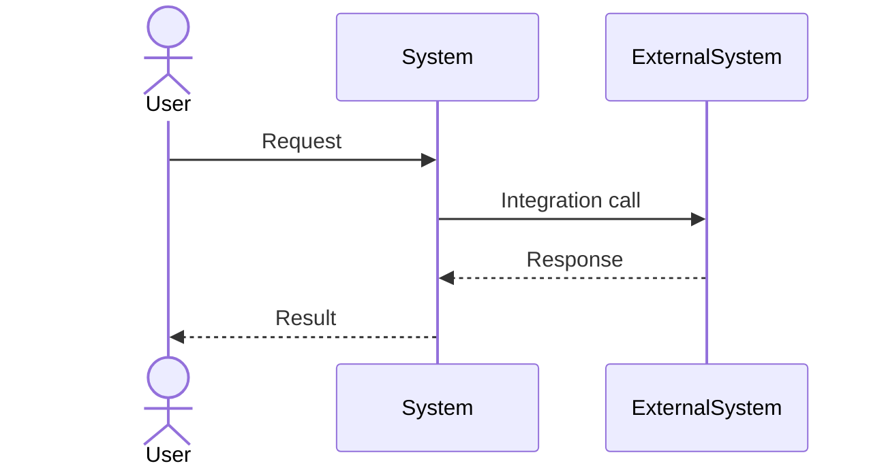

# Integration View

## Document Status
Draft

## Purpose
Define how the target system integrates with other systems, including APIs, events, message flows, contracts, ownership, and integration patterns.

## Owner
<!-- AI_HINT: PENDING_DISCOVERY - DO NOT AUTOFILL -->
TBD

## Last Updated
2026-07-02

---

> Not all architecture views require equal depth.
> Populate this view when system boundaries, APIs, events, external dependencies, or data exchange patterns affect architecture or implementation decisions.

## APIs
<!-- AI_HINT: PENDING_DISCOVERY - DO NOT AUTOFILL -->
Document synchronous APIs exposed or consumed by the target system.

| API | Direction | Provider | Consumer | Contract Location | Notes |
|---|---|---|---|---|---|
| <!-- AI_HINT: PENDING_DISCOVERY - DO NOT AUTOFILL --> TBD | TBD | TBD | TBD | TBD | TBD |

## Events
<!-- AI_HINT: PENDING_DISCOVERY - DO NOT AUTOFILL -->
Document asynchronous events published or consumed by the target system.

| Event | Direction | Producer | Consumer | Payload Owner | Notes |
|---|---|---|---|---|---|
| <!-- AI_HINT: PENDING_DISCOVERY - DO NOT AUTOFILL --> TBD | TBD | TBD | TBD | TBD | TBD |

## Message Flows
<!-- AI_HINT: PENDING_DISCOVERY - DO NOT AUTOFILL -->
Document important request, response, event, batch, or file-exchange flows.

| Flow | Trigger | Source | Target | Expected Outcome |
|---|---|---|---|---|
| <!-- AI_HINT: PENDING_DISCOVERY - DO NOT AUTOFILL --> TBD | TBD | TBD | TBD | TBD |

## Contracts
<!-- AI_HINT: PENDING_DISCOVERY - DO NOT AUTOFILL -->
Document API schemas, event schemas, file formats, message contracts, and compatibility expectations.

| Contract | Type | Owner | Compatibility Rule | Notes |
|---|---|---|---|---|
| <!-- AI_HINT: PENDING_DISCOVERY - DO NOT AUTOFILL --> TBD | TBD | TBD | TBD | TBD |

## Integration Patterns
<!-- AI_HINT: PENDING_DISCOVERY - DO NOT AUTOFILL -->
Document patterns such as request-response, publish-subscribe, batch import, batch export, webhook, polling, or file transfer.

| Pattern | Used For | Rationale | Notes |
|---|---|---|---|
| <!-- AI_HINT: PENDING_DISCOVERY - DO NOT AUTOFILL --> TBD | TBD | TBD | TBD |

## Integration Diagram
<!-- AI_HINT: PENDING_DISCOVERY - DO NOT AUTOFILL -->
Replace this placeholder with a sequence or integration flow diagram when useful.

## Architecture Clarity Notes
<!-- AI_HINT: PENDING_DISCOVERY - DO NOT AUTOFILL -->
Document integration boundaries that developers must preserve during implementation.

---

See [Glossary](../../glossary.md) for definitions of key terms used in this document.
