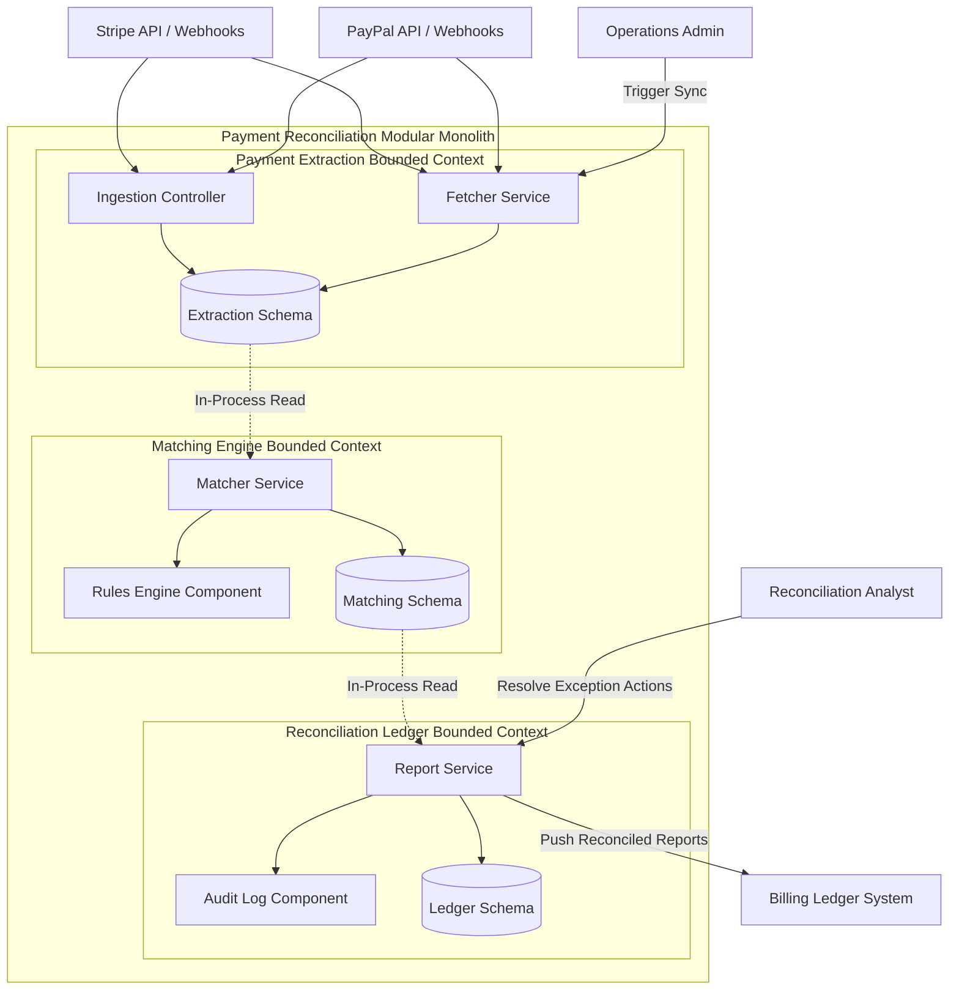

# Logical View

## Document Status
Approved

## Purpose
This document presents the logical design of the Distributed Payment Reconciliation Subsystem, detailing its bounded contexts, container-level services, component organization, and logical relationships.

## Owner
Architecture Team

## Last Updated
2026-06-11

## Bounded Contexts
- **Payment Extraction:** Captures and standardizes transaction data. It maps external vendor-specific schemas (Stripe, PayPal) to a unified internal model and maintains a local cache of raw transaction histories.
- **Matching Engine:** Contains the core algorithmic logic. It executes multi-pass matching rules comparing ingested gateway transactions to billing ledger records based on ID, email, date, amount, and fee details.
- **Reconciliation Ledger:** Manages the lifecycle of reconciliation runs, logs exception reports for mismatches, tracks manual overrides, and handles publishing results to the external Billing Ledger.

## Major Systems
- **Distributed Payment Reconciliation Subsystem:** Deployed as a single Modular Monolith, containing isolated logical modules representing the bounded contexts.

## Containers
- **Fetcher Service (Payment Extraction):** A containerized worker running background daemons to fetch transaction lists via API and listen to webhook routes.
- **Matcher Service (Matching Engine):** A scheduled rule engine worker that processes unmatched records and runs validation rules.
- **Report Service (Reconciliation Ledger):** A web API service serving the dashboard used by Reconciliation Analysts to review mismatches and sync final reconciliations to the Billing Ledger.

## Components
- **Ingestion Controller (Fetcher Service):** Receives gateway webhooks and validates request signatures.
- **Rules Engine (Matcher Service):** Applies match priorities (e.g., direct ID match, fuzzy name/date match) to transactions.
- **Exception Resolver (Report Service):** Governs manual override actions taken by Reconciliation Analysts.

## Relationships
- **Fetcher Service** writes directly to the `Extraction` DB schema.
- **Matcher Service** queries raw transaction records from the `Extraction` DB schema, queries ledger records from the Billing Ledger system, and writes results to the `Matching` DB schema.
- **Report Service** queries match records from the `Matching` DB schema, accepts input from **Reconciliation Analysts**, logs audits in the `Ledger` DB schema, and syncs summaries to the external **Billing Ledger System**.

---

See [Glossary](../../glossary.md) for definitions of key terms used in this document.
