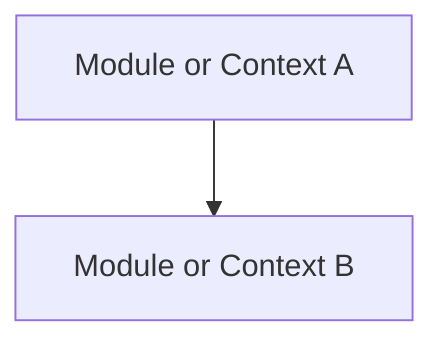

# Logical View

## Document Status
Draft

## Purpose
Define the logical architecture of the target system, including bounded contexts, modules, containers, components, responsibilities, and relationships.

## Owner
<!-- AI_HINT: PENDING_DISCOVERY - DO NOT AUTOFILL -->
TBD

## Last Updated
2026-07-02

---

## Bounded Contexts or Modules
<!-- AI_HINT: PENDING_DISCOVERY - DO NOT AUTOFILL -->
Document the major logical boundaries in the system. Each boundary should have a clear purpose, ownership, and responsibility.

| Context or Module | Purpose | Owns | Must Not Own |
|---|---|---|---|
| <!-- AI_HINT: PENDING_DISCOVERY - DO NOT AUTOFILL --> TBD | TBD | TBD | TBD |

## Major Systems
<!-- AI_HINT: PENDING_DISCOVERY - DO NOT AUTOFILL -->
Document major systems or subsystems and how they relate to the target system.

| System | Responsibility | Relationship |
|---|---|---|
| <!-- AI_HINT: PENDING_DISCOVERY - DO NOT AUTOFILL --> TBD | TBD | TBD |

## Containers or Deployable Units
<!-- AI_HINT: PENDING_DISCOVERY - DO NOT AUTOFILL -->
Document deployable units, runtime processes, applications, services, workers, or jobs.

| Container or Unit | Responsibility | Runtime | Owner |
|---|---|---|---|
| <!-- AI_HINT: PENDING_DISCOVERY - DO NOT AUTOFILL --> TBD | TBD | TBD | TBD |

## Components
<!-- AI_HINT: PENDING_DISCOVERY - DO NOT AUTOFILL -->
Document important components inside each module, context, service, or deployable unit.

| Component | Parent | Responsibility | Notes |
|---|---|---|---|
| <!-- AI_HINT: PENDING_DISCOVERY - DO NOT AUTOFILL --> TBD | TBD | TBD | TBD |

## Relationships
<!-- AI_HINT: PENDING_DISCOVERY - DO NOT AUTOFILL -->
Document logical relationships and dependency directions. Include prohibited dependencies when they are important to preserve boundaries.

| Source | Target | Relationship | Allowed? | Notes |
|---|---|---|---|---|
| <!-- AI_HINT: PENDING_DISCOVERY - DO NOT AUTOFILL --> TBD | TBD | TBD | TBD | TBD |

## Logical Diagram
<!-- AI_HINT: PENDING_DISCOVERY - DO NOT AUTOFILL -->
Replace this placeholder with a C4 container/component diagram or equivalent logical diagram.

## Architecture Clarity Notes
<!-- AI_HINT: PENDING_DISCOVERY - DO NOT AUTOFILL -->
Document logical boundaries that developers must preserve during implementation.

---

See [Glossary](../../glossary.md) for definitions of key terms used in this document.
