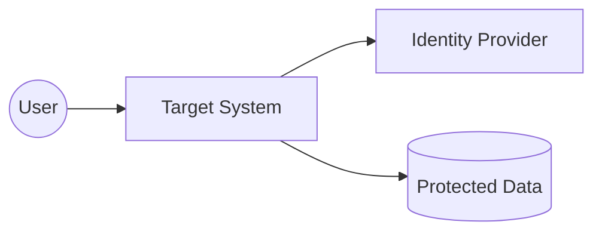

# Security View

## Document Status
Draft

## Purpose
Define the target system's security architecture, including identity, access control, data protection, secrets, audit logging, threat considerations, and compliance requirements.

## Owner
<!-- AI_HINT: PENDING_DISCOVERY - DO NOT AUTOFILL -->
TBD

## Last Updated
2026-07-02

---

> Not all architecture views require equal depth.
> Populate this view when identity, authorization, privacy, compliance, data protection, or operational security concerns affect architecture or implementation decisions.

## Authentication
<!-- AI_HINT: PENDING_DISCOVERY - DO NOT AUTOFILL -->
Document how users, services, systems, and automated processes prove identity.

| Actor or System | Authentication Method | Identity Provider | Notes |
|---|---|---|---|
| <!-- AI_HINT: PENDING_DISCOVERY - DO NOT AUTOFILL --> TBD | TBD | TBD | TBD |

## Authorization
<!-- AI_HINT: PENDING_DISCOVERY - DO NOT AUTOFILL -->
Document roles, permissions, scopes, access checks, and enforcement points.

| Role or Principal | Permission | Enforcement Point | Notes |
|---|---|---|---|
| <!-- AI_HINT: PENDING_DISCOVERY - DO NOT AUTOFILL --> TBD | TBD | TBD | TBD |

## Data Protection
<!-- AI_HINT: PENDING_DISCOVERY - DO NOT AUTOFILL -->
Document encryption, masking, tokenization, privacy constraints, and sensitive-data handling.

| Data or Asset | Protection Requirement | Mechanism | Notes |
|---|---|---|---|
| <!-- AI_HINT: PENDING_DISCOVERY - DO NOT AUTOFILL --> TBD | TBD | TBD | TBD |

## Secrets Management
<!-- AI_HINT: PENDING_DISCOVERY - DO NOT AUTOFILL -->
Document where secrets are stored, rotated, accessed, and audited.

| Secret Type | Storage Location | Access Owner | Rotation Expectation |
|---|---|---|---|
| <!-- AI_HINT: PENDING_DISCOVERY - DO NOT AUTOFILL --> TBD | TBD | TBD | TBD |

## Audit Logging
<!-- AI_HINT: PENDING_DISCOVERY - DO NOT AUTOFILL -->
Document security-relevant events that must be logged and reviewed.

| Event | Reason | Retention | Notes |
|---|---|---|---|
| <!-- AI_HINT: PENDING_DISCOVERY - DO NOT AUTOFILL --> TBD | TBD | TBD | TBD |

## Threat Considerations
<!-- AI_HINT: PENDING_DISCOVERY - DO NOT AUTOFILL -->
Document important threats, misuse cases, trust boundaries, and mitigations.

| Threat or Misuse Case | Impact | Mitigation | Owner |
|---|---|---|---|
| <!-- AI_HINT: PENDING_DISCOVERY - DO NOT AUTOFILL --> TBD | TBD | TBD | TBD |

## Compliance Requirements
<!-- AI_HINT: PENDING_DISCOVERY - DO NOT AUTOFILL -->
Document applicable regulatory, policy, contractual, or internal compliance requirements.

| Requirement | Applies To | Evidence Needed | Notes |
|---|---|---|---|
| <!-- AI_HINT: PENDING_DISCOVERY - DO NOT AUTOFILL --> TBD | TBD | TBD | TBD |

## Security Context Diagram
<!-- AI_HINT: PENDING_DISCOVERY - DO NOT AUTOFILL -->
Replace this placeholder with a diagram showing actors, trust boundaries, and security enforcement points when useful.

## Architecture Clarity Notes
<!-- AI_HINT: PENDING_DISCOVERY - DO NOT AUTOFILL -->
Document security rules that developers must preserve during implementation.

---

See [Glossary](../../glossary.md) for definitions of key terms used in this document.
