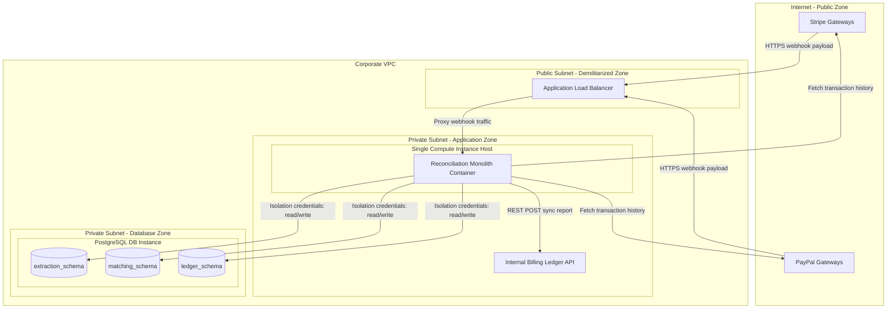

# Deployment View

## Document Status
Archived

## Purpose
Archived example deployment view for the Distributed Payment Reconciliation Subsystem.

## Owner
Architecture Team

## Last Updated
2026-07-02

---

## Archive Notice

This document is archived example content. It is not active project architecture source truth.

---

## Environments
- **Local Development:** Run via Docker Compose, mimicking the schema-per-module database layout locally and utilizing mock API endpoints.
- **Production:** A single active container instance deployed inside a secured virtual private cloud (VPC) subnet, backed by a managed database instance.

## Infrastructure
- **Compute Host:** A single container task (e.g., AWS ECS Fargate or a standalone Docker container on EC2) running the Modular Monolith runtime.
- **Relational Database:** A managed PostgreSQL instance (e.g., AWS RDS) hosting the isolated schemas.

## Network Zones
- **Public Zone (Internet):** Houses the external payment gateways (Stripe/PayPal). Direct ingress from the internet is restricted to secure webhook endpoints via an Application Load Balancer.
- **Private Subnet (Application Zone):** Houses the single compute container host. All database connections and internal Billing Ledger sync operations are routed entirely within this private network.
- **Secure Subnet (Database Zone):** Houses the managed PostgreSQL instance. Direct ingress is restricted solely to the application container security group on port 5432.

## Runtime Components
- **Subsystem Container:** A single OS container enclosing the Fetcher, Matcher, and Report services. The container is configured via environment variables.
- **PostgreSQL Database Instance:** A single host running a database cluster containing three distinct logical schemas (`extraction_schema`, `matching_schema`, `ledger_schema`) to isolate module data.

## Scaling Considerations
- **Vertical Scaling:** The primary method of scaling is vertical (allocating more CPU/RAM to the container instance) given that reconciliation runs are typically executed in batch sequences.
- **Locking & Concurrency:** Horizontal scaling is restricted because matching jobs require sequential write locks on the matching tables. Running a single scheduler container prevents race conditions and duplicate ledger postings.

